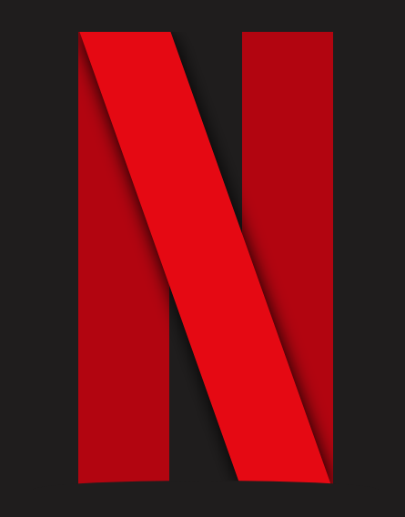
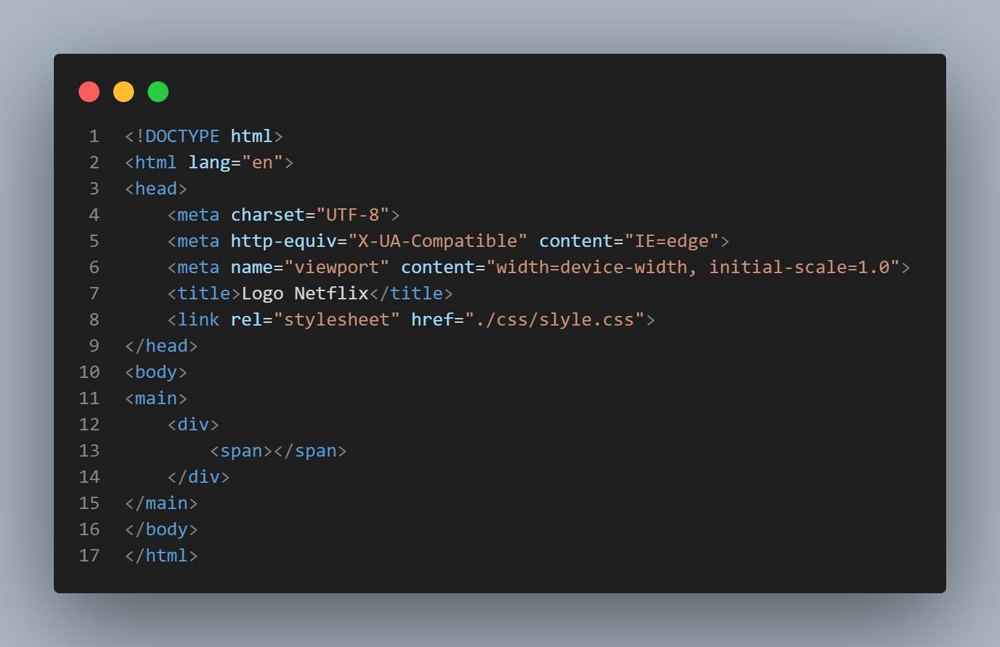
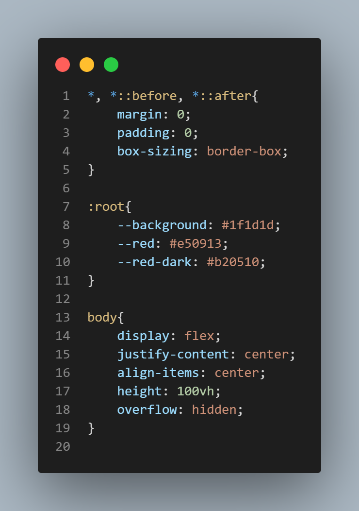
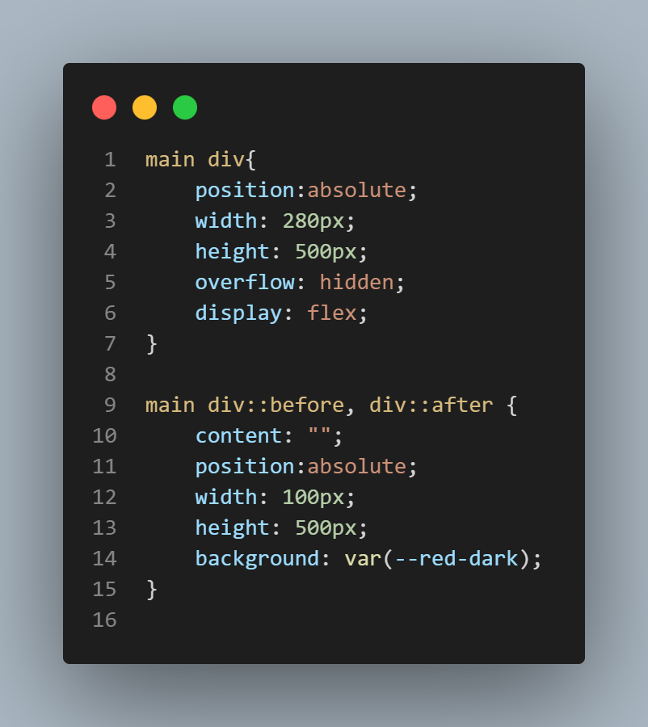
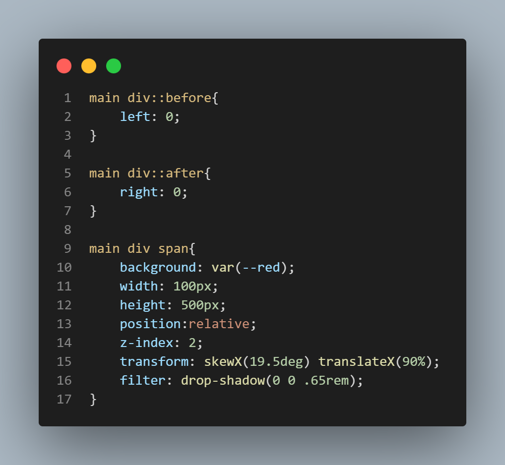

# **LOGO NETFLIX COM HTML5 e CSS**

Projetinho simples, criando a logo da `Netflix` com `HTML5` e `CSS`.

# 📱 ScreenShot Do Logo NetFlix

<h1 align="center">💻 Desenvolvido Por: Gilberto Júnior</h1>